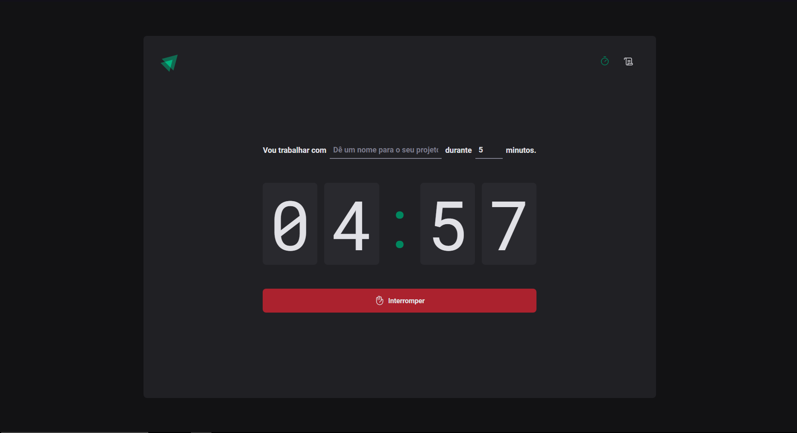

# Pomodoro Timer ⌚

This project allows users to create and manage their tasks with associated Pomodoro timers. 
## My journey 🏃‍♂️

Developed during a bootcamp, this project served me as a practical introduction to **React's useReducer hook** and explores design patterns for state management. At the same time, it enhanced my fluency in CSS-in-JS and the react ecosystem as a whole.
## Technologies ✨

- React ⚛
- Typescript 🔹
- Vite ⚡
- Styled Components 💅
- React Router DOM 🗺
- React Hook Form 📃
- Zod ✅
- date-fns 📅


## Running locally 💻

First, clone the project and change directories:

```bash
git clone git@github.com:Maymisk/Pomodoro-Timer.git
cd Pomodoro-Timer
```

Once inside the directory, install the dependencies:

```bash
yarn
```
or

```bash
npm install
```

Then, simply run the "dev" script and [access the 5173 localhost port!](http://localhost:5173)

```bash
yarn dev
```

or
```bash
npm run dev
```
## Features 💪 

- Create projects and associate Pomodoro Timers to effectively manage work sessions.

- Start, pause, and reset the timer to tailor the work intervals.

- Projects information is stored in the browser's local storage for persistence across sessions.

- Access a list of all the projects created for quick reference.
## Screenshots 📷




